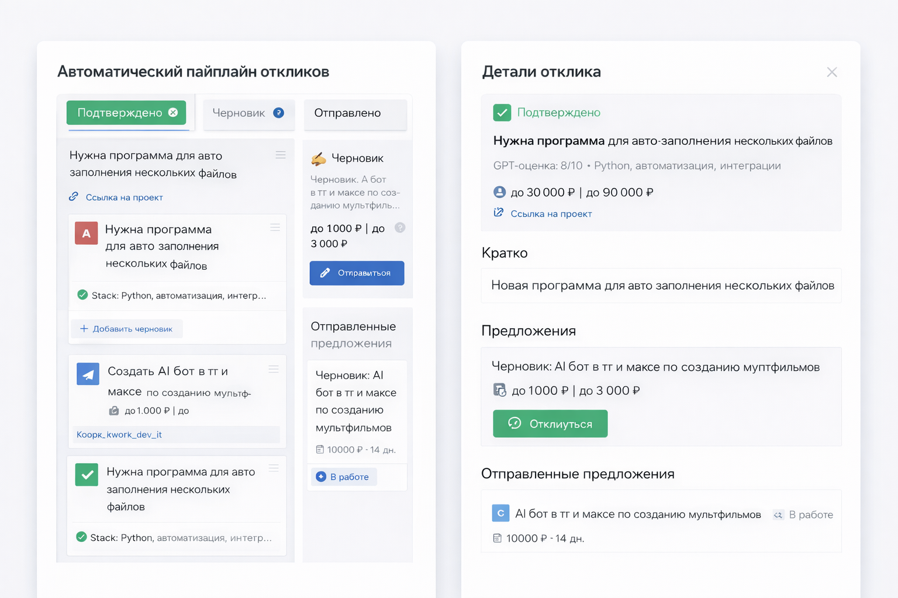

# Freelance Auto-Responder


<!-- MOCKUPS:START -->

<!-- MOCKUPS:END -->

Автоматический пайплайн откликов на фриланс-проекты: **Kwork**, **Яндекс Услуги**, **FL.ru** (и ручной ввод через TG). Daemon сканирует ленты по `config/sources.yaml` → для новых проектов подтягивает контекст из **LightRAG** и примеры откликов → **GPT** оценивает fit и риски → в **Telegram** приходит карточка с кнопкой «Откликнуть».

| Площадка | После approve |
|----------|---------------|
| **Kwork** | Playwright на VPS заполняет черновик формы (этапы, цена, срок) **без «Предложить»** → ты проверяешь на сайте → **Подтвердить отклик** |
| **Яндекс / FL.ru / ТЗ из TG** | Бот присылает текст + цену + срок → **копируешь вручную** на площадку → **Подтвердить отклик** |

Журнал Excel на VPS. **`/journal`** — дописать подтверждённые отклики, подтянуть статусы Kwork с `/offers`, прислать `.xlsx` в чат.

## Архитектура

| Где | Роль |
|-----|------|
| **VPS** (`/opt/freelance-responder`) | daemon: скан Kwork/Яндекс/FL.ru, GPT, TG-бот, Playwright prepare (Kwork), **Excel-журнал** |
| **ПК (Windows)** | разработка, Kwork-login, опционально локальная копия журнала |
| **LightRAG** | на том же VPS (`http://127.0.0.1:9621`) |
| **Excel** | на VPS: `/opt/freelance-responder/data/response_journal.xlsx` (лист «Мои отклики»); бот присылает файл в TG по `/journal` |

Рабочий журнал ведётся **на VPS**. Команда `/journal` в Telegram: дописывает подтверждённые `prepared_responses`, подтягивает статусы с Kwork `/offers`, отправляет обновлённый `journal.xlsx` в чат. Кнопка **«Подтвердить отклик»** после prepare пишет строку в журнал сразу (тоже на VPS).

---

## Последние изменения (июль 2026)

| Область | Что сделано |
|---------|-------------|
| **Мультиплатформа** | Скан и отклики: Kwork + Яндекс Услуги + FL.ru (`config/sources.yaml`) |
| **Manual-copy flow** | Яндекс / FL.ru / ТЗ из TG: текст в TG → ручная отправка на сайте → confirm в журнал |
| **TG-команды** | `/project <url>` — ручной заказ с любой площадки; `/tz <текст>` — ТЗ без ссылки |
| **Журнал: dedupe** | `project_ids_in_journal()` парсит Kwork `/projects/{id}`, FL.ru `/projects/{id}`, Яндекс `/order/{uuid}` — повторный confirm не дублирует строку |
| **Журнал: snapshot** | Чтение текста с Kwork `/offers` только для `platform == "kwork"`; Яндекс/FL.ru берут текст из prepared_store |
| **Журнал: статусы** | После confirm: **«Отправлен»** (Яндекс/FL.ru/TG) или **«Подготовлен»** (Kwork, ждёт sync с `/offers`) |
| **Prepare Kwork** | Клик «По мере выполнения задач»; verify этапов/цены; retry GPT+форма; «Заполнить форму снова» |
| **TG-сервис** | `/journal` — Excel + sync; **`/report`** — отчёт по 3 последним сканам |
| **VPS sync** | `deploy/sync_journal_from_vps.py`, `sync_journal_on_vps.py` — offers + prepared на сервере |

---

## Что в Git, что нет

**В репозитории:** `src/`, `config/`, `deploy/`, `tests/`, `.env.example`, `requirements.txt`.

**Не коммитить** (см. `.gitignore`):

- `.env` — ключи
- `data/kwork_storage.json`, `data/kwork_browser_profile/` — сессия Kwork
- `data/seen_projects.db`, `data/prepared_responses/`, `data/pending_offers/`
- `logs/`

Перед push: `git status` — секретов и runtime-данных быть не должно.

---

## Восстановление ПК (Windows)

### 1. Клонировать и окружение

```powershell
git clone <repo-url> "C:\Python\Projects\Freelance Auto-Responder"
cd "C:\Python\Projects\Freelance Auto-Responder"
python -m venv venv
.\venv\Scripts\activate
pip install -r requirements.txt
playwright install chromium
```

### 2. `.env`

```powershell
copy .env.example .env
```

Заполнить минимум:

| Переменная | ПК |
|------------|-----|
| `OPENAI_API_KEY` | ключ OpenAI / ProxyAPI |
| `TELEGRAM_BOT_TOKEN` | токен бота |
| `TELEGRAM_CHAT_ID` | твой chat id |
| `RESPONSE_JOURNAL` | `C:/Python/Projects/Zerocode2md/ResponseJournal/journal.xlsx` |
| `RESPONSE_EXAMPLES_DIR` | `C:/Python/Projects/Zerocode2md/Output/Отклики` |
| `BROWSER_ADAPTER` | `external` (локальная отладка) или `playwright` |
| `FLRU_STORAGE_STATE` | `data/flru_storage.json` (сессия FL.ru) |
| `FLRU_MAX_DAILY_RESPONSES` | soft-лимит FL.ru manual-copy (default 10) |
| `YANDEX_MAX_DAILY_RESPONSES` | soft-лимит Яндекс manual-copy (default 7) |

Для локальной отладки браузера через BrowserMCP — `BROWSERMCP_SERVER`.

### 3. SSH к VPS

В `~/.ssh/config`:

```
Host LightRAG_Naive
    HostName 45.144.28.49
    User root
    IdentityFile C:/Users/User/.ssh/alexklyvibe
```

Имя хоста используется в `deploy/*.ps1`, `deploy/*.py`.

### 4. Excel-журнал (опционально на ПК)

Для локальной копии с VPS:

```powershell
python deploy\sync_journal_from_vps.py
```

Откроется/обновится `journal.xlsx` по пути из `RESPONSE_JOURNAL` в `.env` на ПК. **В проде** журнал на VPS; актуальный файл — через `/journal` в Telegram.

### 5. Сессия Kwork (раз в N недель / после logout)

```powershell
.\venv\Scripts\activate
python deploy\kwork_login_interactive.py
```

1. Залогиниться в открывшемся Chrome  
2. Enter в терминале  
3. Скрипт сохранит `data/kwork_storage.json` и зальёт на VPS + перезапустит daemon  

Если интерактивный скрипт упал после логина:

```powershell
python deploy\export_kwork_profile_session.py
```

### 6. Локальные тесты

```powershell
pytest
python -m src.scheduler run-test   # нужен рабочий .env и браузер
```

---

## Восстановление VPS (с нуля)

**Путь:** `/opt/freelance-responder`  
**Сервис:** `freelance-responder.service`  
**Логи:** `/opt/freelance-responder/logs/daemon.log`

### 1. Подготовка сервера

```bash
ssh LightRAG_Naive
mkdir -p /opt/freelance-responder/{data/examples,data/prepared_responses,data/pending_offers,logs}
```

### 2. Деплой с ПК

```powershell
cd "C:\Python\Projects\Freelance Auto-Responder"
.\deploy\deploy.ps1
```

Скрипт копирует `src`, `config`, `deploy`, `.env`, примеры откликов, журнал-шаблон и запускает `install.sh`.

### 3. Ручной деплой (без deploy.ps1)

```powershell
scp -r src config deploy requirements.txt LightRAG_Naive:/opt/freelance-responder/
scp .env LightRAG_Naive:/opt/freelance-responder/.env
scp "C:\Python\Projects\Zerocode2md\ResponseJournal\journal.xlsx" LightRAG_Naive:/opt/freelance-responder/data/response_journal.xlsx
scp -r "C:\Python\Projects\Zerocode2md\Output\Отклики\*" LightRAG_Naive:/opt/freelance-responder/data/examples/
ssh LightRAG_Naive "bash /opt/freelance-responder/deploy/install.sh"
```

### 4. `.env` на VPS (отличия от ПК)

`install.sh` нормализует пути. Проверить вручную:

```bash
grep -E '^(BROWSER_ADAPTER|OPENAI_BASE_URL|LIGHTRAG|KWORK|PREPARE|RESPONSE)' /opt/freelance-responder/.env
```

| Переменная | VPS |
|------------|-----|
| `BROWSER_ADAPTER` | `playwright` |
| `OPENAI_BASE_URL` | `https://api.openai.com/v1` |
| `LIGHTRAG_BASE_URL` | `http://127.0.0.1:9621` |
| `LIGHTRAG_API_KEY` | из `/opt/LightRAG/.env` |
| `KWORK_AUTO_LOGIN` | `false` (капча) |
| `KWORK_STORAGE_STATE` | `/opt/freelance-responder/data/kwork_storage.json` |
| `PREPARE_ONLY_NO_SUBMIT` | `true` |
| `SCAN_INTERVAL_MINUTES` | `15` |
| `OPERATOR_TIMEZONE` | `Asia/Irkutsk` (для `/report`) |
| `RESPONSE_JOURNAL` | `/opt/freelance-responder/data/response_journal.xlsx` |
| `RESPONSE_EXAMPLES_DIR` | `/opt/freelance-responder/data/examples` |

### 5. Kwork-сессия на VPS

С ПК после логина:

```powershell
python deploy\export_kwork_profile_session.py
# или
python deploy\kwork_login_interactive.py
```

Проверка:

```bash
ssh LightRAG_Naive "cd /opt/freelance-responder && PYTHONPATH=. .venv/bin/python deploy/verify_kwork_session.py"
```

### 6. Запуск и проверка

```bash
sudo systemctl start freelance-responder
sudo systemctl enable freelance-responder
systemctl status freelance-responder
tail -f /opt/freelance-responder/logs/daemon.log
```

Тестовый прогон:

```bash
cd /opt/freelance-responder
PYTHONPATH=. .venv/bin/python -m src.scheduler run-test
```

---

## Обновление после `git push`

### ПК

```powershell
git pull
.\venv\Scripts\activate
pip install -r requirements.txt
```

### VPS

```powershell
# с ПК
scp -r src config deploy requirements.txt LightRAG_Naive:/opt/freelance-responder/
ssh LightRAG_Naive "cd /opt/freelance-responder && .venv/bin/pip install -r requirements.txt && sudo systemctl restart freelance-responder"
```

Или полный `deploy\deploy.ps1` (перезапишет `.env` на VPS — осторожно).

---

## Telegram — как пользоваться

### Команды

| Команда | Что делает |
|---------|------------|
| `/start` | Краткая справка по боту |
| `/project <url>` | Ручной разбор заказа по ссылке (Kwork / Яндекс / FL.ru) |
| `/tz <текст>` | Ручной разбор ТЗ без ссылки (или `/tz` → следующим сообщением текст) |
| `/journal` | Sync журнала на VPS + файл `journal.xlsx` в чат |
| `/report` | Отчёт по 3 последним сканам (время в `OPERATOR_TIMEZONE`) |

Можно просто **вставить ссылку** в чат (без `/project`) — бот распознает Kwork, Яндекс или FL.ru.

Reply на черновик отклика = правка текста перед отправкой (работает для всех площадок).

---

### Общий сценарий (автоскан)

1. Daemon находит проект → **карточка** в Telegram (оценка GPT, риски, ссылка).
2. **Откликнуть** → GPT генерирует черновик.
3. (опционально) Reply с правками текста.
4. Дальше — по площадке (см. ниже).
5. **✅ Подтвердить отклик** → строка в Excel на VPS.
6. **`/journal`** — скачать актуальный журнал + обновить статусы Kwork.

---

### Kwork — автозаполнение формы

```
Карточка → Откликнуть → (правки reply) → форма заполнена на VPS
→ открываешь ссылку под тем же аккаунтом Kwork
→ проверяешь → «Предложить» на сайте
→ ✅ Подтвердить отклик в TG
```

**Кнопки после prepare:**

| Кнопка | Действие |
|--------|----------|
| **✅ Подтвердить отклик** | Запись в Excel. Бот попробует прочитать финальный текст с Kwork `/offers`; если не вышло — возьмёт prepared-текст |
| **🔄 Перегенерировать** | Новый GPT-текст + повторное заполнение формы |
| **🔁 Заполнить форму снова** | (если prepare упал) — retry без перегенерации |

**Статус в Excel после confirm:** `Подготовлен` → `/journal` обновит с `/offers` на `Отправлен` / `Отклонён` / и т.д.

---

### Яндекс Услуги / FL.ru — manual copy

Площадки без автозаполнения формы на VPS. Бот присылает готовый текст блоками (удобно копировать).

```
Карточка → Откликнуть → (правки reply)
→ 📋 «скопируй вручную» + текст + цена + срок + ссылка
→ открываешь заказ на площадке → вставляешь → отправляешь
→ ✅ Подтвердить отклик в TG
```

**Кнопки:**

| Кнопка | Действие |
|--------|----------|
| **✅ Подтвердить отклик** | Запись в Excel **после** того как ты реально отправил на сайте |
| **🔄 Перегенерировать** | Новый текст (без браузера) |

**Статус в Excel сразу после confirm:** `Отправлен` / `Жду ответа`.

Лимиты (soft, показываются в сообщении): Яндекс ~7/сутки, FL.ru ~10/сутки (`YANDEX_MAX_DAILY_RESPONSES`, `FLRU_MAX_DAILY_RESPONSES` в `.env`).

**Dedupe:** если заказ уже есть в Excel (по URL `/order/{uuid}` или `fl.ru/projects/{id}`), кнопка ответит «Уже в журнале» — дубль не создастся.

---

### Ручной ввод — `/project` и `/tz`

**Пропустил автоскан или заказ пришёл из другого канала:**

```
/project https://uslugi.yandex.ru/order/342870b9-bea4-40b7-a616-81061dc845db
/project https://www.fl.ru/projects/5514790/some-title.html
/project https://kwork.ru/projects/123456/view
```

```
/tz Нужен бот для Telegram, бюджет 15к, срок 2 недели...
```

или:

```
/tz
→ следующим сообщением полный текст ТЗ
```

Дальше тот же flow: карточка → approve → Kwork prepare **или** manual copy.

---

### Журнал Excel — колонки и статусы

| Колонка | Содержимое |
|---------|------------|
| A | № |
| B | Дата |
| C | Площадка (Kwork / Яндекс Услуги / FL.ru / Telegram) |
| D | URL (гиперссылка) |
| E | Тип проекта |
| F | **Статус** |
| G | **Результат** |
| H | Описание заказа |
| I | Текст отклика + цена + срок |

**Статус после «Подтвердить отклик»:**

| Площадка | Кол. F (статус) | Когда меняется дальше |
|----------|-----------------|------------------------|
| Kwork | `Подготовлен` | `/journal` → sync с `/offers` |
| Яндекс / FL.ru / TG | `Отправлен` | вручную в Excel или phase 2 (автосинк) |

**`/journal`** делает на VPS:
1. Дописывает подтверждённые `prepared_responses`, которых ещё нет в Excel.
2. Для **Kwork** — обновляет статусы с `/offers`.
3. Присылает `.xlsx` в Telegram.

Локальная копия на ПК (опционально): `python deploy\sync_journal_from_vps.py`.

---

### Частые ситуации

| Ситуация | Что делать |
|----------|------------|
| Нажал confirm, но ещё не отправил на сайте (Яндекс/FL.ru) | Не нажимай confirm до реальной отправки — статус сразу `Отправлен` |
| Confirm для Kwork — текст в Excel не тот | Бот читает с `/offers`; если сессия Kwork протухла — будет prepared-текст; обнови `kwork_storage.json` |
| «Уже в журнале» | Заказ уже в Excel (dedupe по project_id из URL) |
| Нужен свежий Excel | `/journal` в TG |
| Prepare упал на Kwork | **Заполнить форму снова** или **Перегенерировать** |

---

## Бэкап runtime-данных (не в Git)

Периодически сохранять:

| Что | ПК | VPS |
|-----|-----|-----|
| Секреты | `.env` | `/opt/freelance-responder/.env` |
| Kwork session | `data/kwork_storage.json` | то же на VPS |
| Очередь Excel | — | `data/prepared_responses/*.json` |
| Pending TG | — | `data/pending_offers/*.json` |
| БД скана | `data/seen_projects.db` | то же |
| Excel | локальная копия (опц.) | `data/response_journal.xlsx` |

Пример бэкапа VPS:

```bash
tar czf /root/freelance-backup-$(date +%F).tar.gz \
  /opt/freelance-responder/.env \
  /opt/freelance-responder/data/kwork_storage.json \
  /opt/freelance-responder/data/prepared_responses \
  /opt/freelance-responder/data/pending_offers \
  /opt/freelance-responder/data/seen_projects.db
```

---

## Полезные скрипты

| Скрипт | Назначение |
|--------|------------|
| `deploy/deploy.ps1` | полный деплой на VPS |
| `deploy/install.sh` | venv + playwright + systemd на VPS |
| `deploy/kwork_login_interactive.py` | логин Kwork → session |
| `deploy/export_kwork_profile_session.py` | экспорт session из профиля |
| `deploy/sync_journal_from_vps.py` | скачать журнал с VPS на ПК (опционально) |
| `deploy/sync_journal_on_vps.py` | ручной sync на VPS + отправка в TG |
| `deploy/verify_kwork_session.py` | проверка логина на VPS |
| `deploy/rerun_prepare.py` | повторный prepare по project_id |
| `deploy/probe_draft_stages_persist.py` | проверка сохранения этапов в черновик |
| `deploy/reset_journal_exported.py` | сброс флага для повторной синхронизации |

---

## Troubleshooting

| Симптом | Решение |
|---------|---------|
| Кнопки TG не работают | `systemctl status freelance-responder` — нужен daemon, не только run-test |
| Prepare: этапы пустые после reload | обновить `kwork.py`; проверить milestone + autosave 15s; F5 на `new_offer` |
| Prepare: not_logged_in | обновить `kwork_storage.json` с ПК |
| Prepare: greenlet error | обновить `src/pipeline/orchestrator.py` на VPS |
| Журнал пустой / нет строки | `/journal` в TG; проверить `journal_confirmed` в `prepared_responses/` |
| `/journal` без файла | смотреть лог daemon; путь `RESPONSE_JOURNAL` на VPS |
| Яндекс/FL.ru: «Уже в журнале» без кнопки | норма — dedupe по UUID/id из URL в Excel |
| Яндекс/FL.ru: confirm, но статус «Подготовлен» | обновить код на VPS (старый билд); manual-copy → «Отправлен» |
| 0 проектов в скане | проверить сессию / `enabled: true` в `sources.yaml` |
| FL.ru not_logged_in | обновить `flru_storage.json` (аналог kwork login) |

---

## Структура проекта

```
src/
  adapters/          # Kwork, Yandex, FL.ru, auth, pricing
  analyzer/          # GPT scorer, LightRAG client
  browser/           # Playwright / MCP
  journal/           # Excel writer, kwork status sync, vps sync
  pipeline/          # orchestrator, manual_copy
  telegram_bot/      # aiogram bot
  responses/         # prepared_store
deploy/              # деплой, sync, kwork/flru login
config/sources.yaml  # источники скана (kwork, yandex, flru, telegram)
data/                # runtime (не в git)
tests/
```
